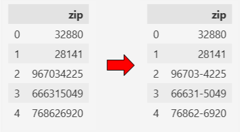
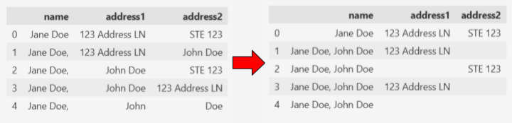
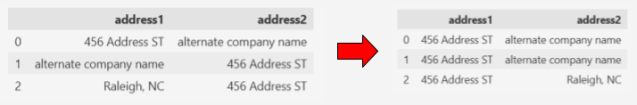
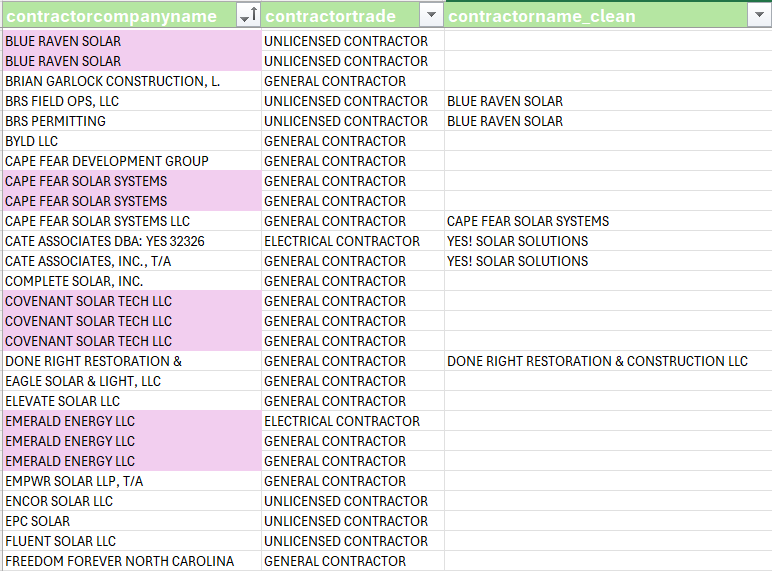
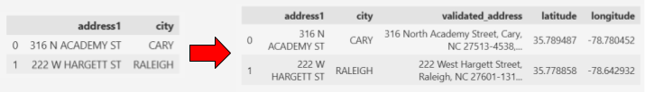

# Solar Permit Applications: Cleaning Open Data From Cary, NC
Python code used for reusable data cleaning for solar permit application data from the town of Cary, NC.

## Abstract
This project contains reusable Python functions for cleaning residential solar permit application data from the Town of Cary, NC. This pipeline standardizes ZIP codes, reorganizes owner and contractor address data, standardizes contractor name data through human-in-the-loop Excel workflow, and validates address data using the Google Maps API. The cleaned dataset is included for future analysis with all PII (Personally Identifiable Information) removed.
### Features
- reusable Python data cleaning pipeline
- ZIP code standardization
- owner name and address reconstruction
- contractor address reorganization
- human-in-the-loop contractor name standardization using Excel
- Google Maps API integartion
- latitude and longitude data extraction

## Methodology
### Technologies
- Python
- pandas
- openpyxl
- Google Maps API
- jupyter notebook
- Excel
### Data info
Data was acquired from data.gov's website (https://catalog.data.gov/dataset/solar-permit-applications#content) that was last updated on May 18th, 2026. The data is exclusively for residential solar permit applications, and originally contains 1981 rows and 26 columns before cleaning.

The repository includes screenshots showing:
- Zip code formatting
- owner name and address cleaning
- contractor address reordering
- Excel contractor name standardization
- Google Mapss address validation
### Steps Taken
1. import raw data
2. clean ZIP codes
3. correct fragmented owner names and addresses
4. reorganize contractor address data
5. export contractor data to Excel
6. manually standardize contractor names
7. import standardized names from Excel
8. validate addresses
9. save cleaned dataset
## Library Documentation
### cleaning.py
#### `zip_clean()`
- ZIP codes in the dataset can appear as either 5-digt ZIP codes or 9 digit ZIP+4 codes without separators. zip_clean() standardizes all 9-digit values into the #####-#### format and keeps all 5_digit values the same.

#### `is_address1()`
- for cleaning address data, being able to identify if a value is an address or not is necessary. The is_address1 function does this by checking if the first or last character is numeric. Most addresses in the US typically start with a string of numbers followed by the remaining address components. In the solar permits dataset, some address data includes a PO box rather than a street address, so checking the last character is necessary for identifying those few instances.
#### `is_address2()`
- most entries in the dataset do not contain address2 data, but some do. Therefore it is also necessary to identify those instances where the data belongs in the address2 column. To determine whether a value is address2 data, the value is split and parsed for strings that are common in address 2 data (e.g. ‘Raleigh, NC’ or ‘STE 123’). The is_address2 function makes that determination.
#### `owner_address_reorder()`
- owner name and address data in the dataset is fragmented among three columns, ‘ownername’, ‘owneraddress1’, and ‘owneraddress2’. owner_address_reorder() utilizes is_address1() and is_address2() to identify which values belong where and reorganizes them to fit the defined data structure.
#### `owner_address_clean()`
- as previously mentioned, owner name and address data is fragmented. owner_address_clean() applies the `owner_address_reorder()` function to the entire dataset and cleans the fragmented data.

|Case|Issue|Action|
|----|-----|------|
|0|Already correct|No change|
|1|Name data stored in address2 column|Move name data to name column|
|2|Name data stored in address1 column|Move name data to name column|
|3|Name data stored in address1 column and address1 stored in address2 column|Move name data to name column and move address1 data to address1 column|
|4|Name data stored in address1 and address2 columns|Move name data to name column|
#### `contractor_address_reorder()`
- the contractor address information can sometimes be mixed up similar to the owner address information. For future contractor name cleaning steps it is important to keep all information as alternate company names are sometimes included in the address data.

|Case|Issue|Action|
|----|-----|------|
|0|Already correct|No change|
|1|Alternate company name data stored in address1 column and address1 data stored in address2 column|Swap address1 and address2 data|
|2|Address2 data stroed in address1 column, and address1 data stored in address2 column|Swap address1 and address2 data|

### excel.py
#### `extract_contractor_info()`
- takes all contractor columns and extracts all unique instances within the data for cleaning purposes and creates a dataset containing the unique data (originally 107 unique contractor company names).
#### `excel_append_contractors()`
- adds unique contractor data to an Excel worksheet. If there already exists contractor data on the worksheet, only new contractor information will be added (keeps already cleaned contractor data safe from being overwritten). After contractor data has been added to the worksheet, the data is manually parsed to clean contractor company names using trade, address, and phone data. I used sorting, filtering, and conditional formatting to help identify which names needed to be updated.

**Contractor address and phone data columns were hidden to protect Personally Identifiable Information**
#### `set_latest_protection_sheet()`
- creates/edits a hidden ‘META DATA’ worksheet in the Excel file to add sheet names and datetime data for when they are added to create a log of saved protection sheets used in the future to read in the most recently updated data.
#### `create_protection_sheet`
- after manually cleaning contractors data in an Excel worksheet, this function is used to copy all data to a locked worksheet in the same workbook. The set_latest_protection_sheet function is then used to save the protection sheet's name to the ‘META DATA’ sheet to keep a log for all saved data after cleaning.
#### `import_protection_sheet()`
- this function is used to parse the ‘META DATA’ worksheet for the most recently added protection sheet and imports the data from that protection sheet as a pd.DataFrame.
#### `clean_contractor_names()`
- uses the import_protection_sheet column to import contractor cleaning data and replaces all contractor names with their correct names. This decreases the amount of contractor names from 107 to 86.

### address_validation.py
#### `validate_address()`
- applies the google maps API’s ‘addressvalidation’ function to address and city data.
#### `apply_address_validation()`
- applies the `validate_address()` function to a dataframe. If there exists a file with previously validated address data, that file and the primary key (‘permitnum’ for the solar permits data) can be included in the function so that only non-validated rows will have the `validate_address()` function applied to them. This allows for faster address validation as new data is released, and alleviates validated address data from being passed through the API again. The validated address and latitude and longitude data is saved to new columns in the dataset.

**Cary's Town Hall and Raliegh's Municipal Building addresses were passed through the `apply_address_validation()` function to find their exact address and geographical coordinates**

### inflation_adjust.py
#### `extract_CPI_data()`
- extracts Consumer Price Index data from a url (I used the data found here: https://data.bls.gov/timeseries/CUUR0000SA0?years_option=all_years)
#### `clean_CPI_data()`
- removes unnecessary columns from the CPI data, changes month names to corresponding integer values, and uses the pandas `.melt()` function to transform the CPI data into a more usable form.
#### `replace_missing_values()`
- finds all indices with a CPI value of '-(X)' for months where data was not collected, then uses numpy's `.interp()` function to use Linear Interpolation to estimate the missing values, and inplaces those estimates in place of all '-(X)' values
#### `CPI_data()`
- applies `extract_CPI_data()`, `clean_CPI_data()`, and `replace_missing_values()` function to a url (https://data.bls.gov/timeseries/CUUR0000SA0?years_option=all_years) to extract, clean, and estimate missing values for the Consumer Price Index data
#### `merge_CPI()`
- takes an inputted dataframe and date column and joins it with the CPI data on the Year and Month of that date given by the date column
#### `calculate_inlfation_adjustment()`
- uses `CPI_data()` to extract and clean the CPI data from a url (https://data.bls.gov/timeseries/CUUR0000SA0?years_option=all_years), extracts the most recent entry in the CPI data, then calculates the adjusted inflation amount on a specified column, and saves that as a new column containing the month and year from the most recent CPI value

## Results
The reusable cleaning pipeline:
- standardized ZIP code formatting accross all ZIP columns
- repaired fragmented owner name and address data
- reorganized contractor addresses
- reduced contractor company names from 107 unique entries to 86 standardized names
- added validated addresses
- added latitude/longitude coordinates
- adjusted the project cost data for inflation for more accurate analysis
- produced a reusable workflow for future data releases

## Future Work
Future analysis will use the cleaned dataset to:
- analyze contractor data
- explore reisdential solar adoption trends
- integrate U.S. Census demographic data
- explore relationships between demographics and solar adoption in the town of Cary, NC